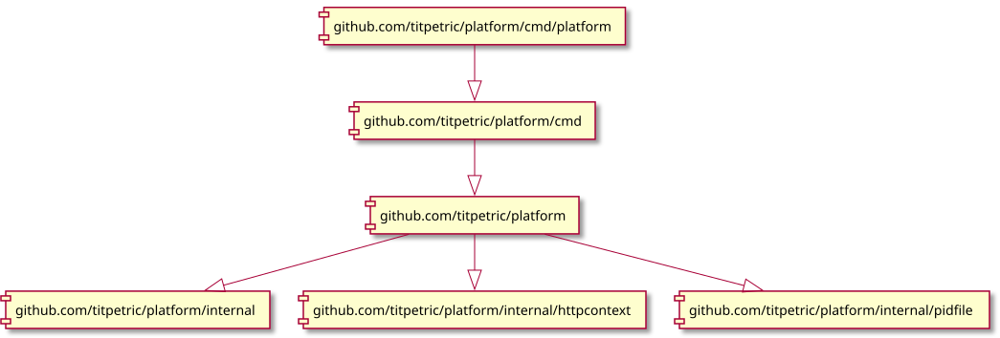
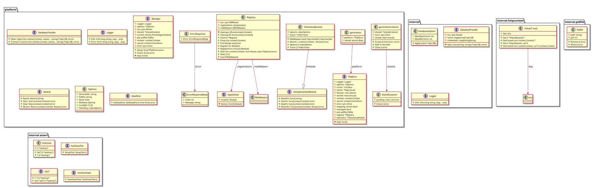

# Structural diagram

## Modules

The repository holds two Go modules.

`github.com/titpetric/platform` is the module consumers import. It depends on chi, sqlx, oida and ulid, and on no sql driver. Its tests are the white box ones: they cover unexported behaviour and add no dependency of their own.

`github.com/titpetric/platform/tests` is the black box test suite. It replaces the platform with the checkout above it, and it is where the mysql, pgx and sqlite drivers are pinned. `tests/main_test.go` registers all three with `database/sql` in package init, so every test in the suite can open any of the three DSN forms without importing a driver.

The split keeps driver pins out of the consumer dependency tree. Run both with `atkins`; the root module alone is `go test ./...`, the suite is `go test ./...` from `tests/`.

## Diagrams

The following structural diagram is generated from source code. It shows the ways that packages depend on each other within the system.

Import diagram:

Class diagram:

